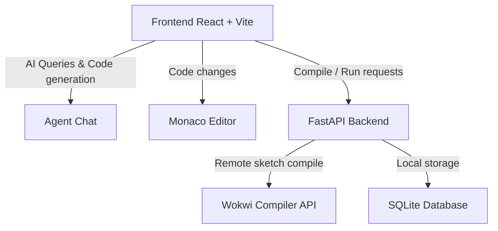

# 🔌 Promptduino

Promptduino is a smart, AI-assisted development workspace for Arduino. It combines an interactive LLM chat assistant, a Monaco-powered code editor, a custom hardware simulation panel, a serial monitor, and live compilation tools to streamline micro-controller programming.

---

## 🌟 Key Features

- **💬 AI Agent Chat:** An integrated chatbot designed to help you write, debug, document, and refactor Arduino sketch code on the fly.
- **💻 Pro Code Editor:** Powered by the Monaco Editor, featuring syntax highlighting, error checking, and code formatting tailored for Arduino C++.
- **🛠️ Simulation Panel:** Render and visualize hardware designs and interact with virtual micro-controllers and components.
- **📟 Serial Monitor:** Real-time feedback from simulated hardware execution and compiler diagnostics.
- **🚀 One-Click Compilation:** Instant remote compilation leveraging the Wokwi build backend.

---

## 🏗️ Project Architecture

Promptduino is built as a modern full-stack web application:



### Tech Stack
- **Frontend:** React 19, Vite, Tailwind CSS v4, Monaco Editor, Zustand (state management), Lucide React (icons), and Framer Motion.
- **Backend:** FastAPI (Python), SQLite (database storage), and Uvicorn.

---

## 📂 Repository Layout

```
Promptduino/
├── api/                  # FastAPI Backend Source
│   ├── db/               # Database models & configuration
│   ├── index.py          # FastAPI application routes (compile, simulate, etc.)
│   ├── requirements.txt  # Python backend dependencies
│   └── promptduino.db    # SQLite database
├── src/                  # React Frontend Source
│   ├── components/       # Workspace UI components
│   │   ├── AgentChat.jsx # Chatbot assistant panel
│   │   ├── CodeEditor.jsx# Code editing workspace
│   │   └── ...           # Navbar, SerialMonitor, SimulationPanel, etc.
│   ├── App.jsx           # Main application entry layout
│   ├── index.css         # Styling system and Tailwind directives
│   └── store.js          # Shared state using Zustand
├── index.html            # Web application entry point
├── package.json          # Frontend packages & scripts
└── vite.config.js        # Vite configurations
```

---

## 🚀 Getting Started

Follow these steps to run the Promptduino workspace locally:

### 1. Backend Setup (FastAPI)
Navigate to the root directory and install Python dependencies:
```bash
pip install -r api/requirements.txt
```

Run the FastAPI application with Uvicorn:
```bash
uvicorn api.index:app --reload --port 8000
```
The API server will run at `http://localhost:8000`.

### 2. Frontend Setup (React + Vite)
In a new terminal, install package dependencies from the root directory:
```bash
npm install
```

Start the development server:
```bash
npm run dev
```
Open `http://localhost:5173` in your browser to view and interact with Promptduino.

---

## 💡 How it Works

1. Ask the **AI Agent** in the chat panel to write a program (e.g., *"Write a program to blink an LED on pin 13"*).
2. The agent produces the code, which you can copy or insert into the **Code Editor**.
3. Click **Compile** to verify your code's syntax against the Wokwi compilation API.
4. Interact with the simulated circuit in the **Simulation Panel** and check the output logs in the **Serial Monitor**.
